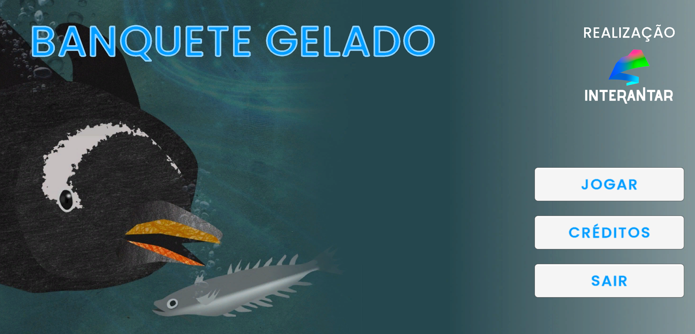
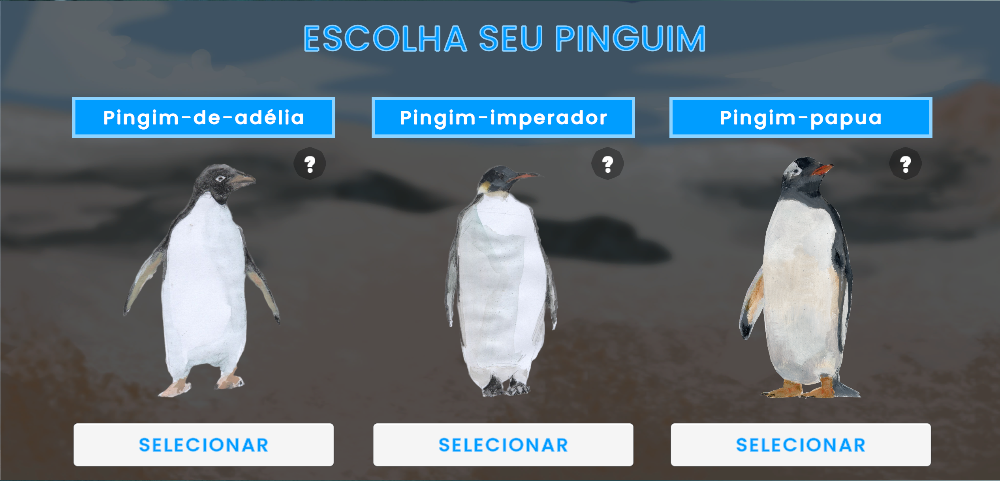
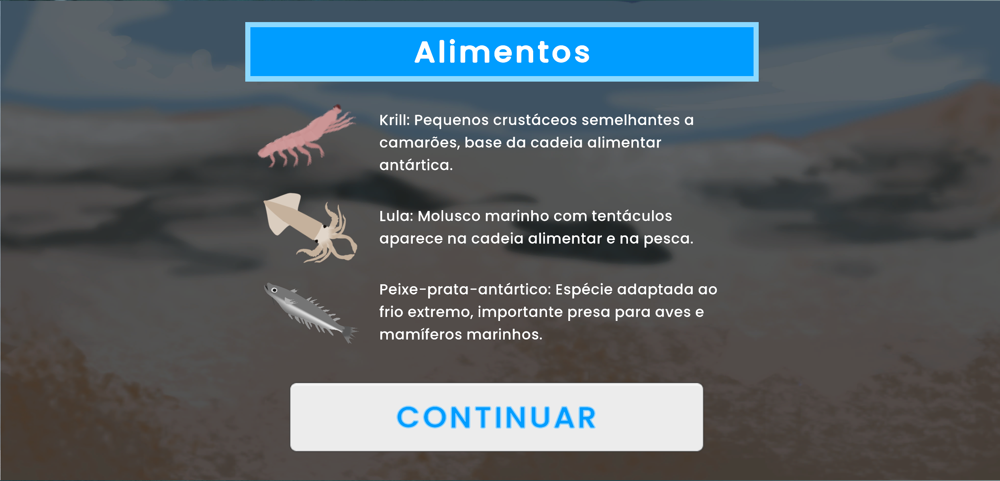

# **Banquete Gelado**

**Banquete Gelado** is a **top-down 2D game** where players control a **penguin** on a quest to collect food and return it safely to its nest. **Designed for children**, the game combines **simple mechanics** with engaging gameplay to encourage **problem-solving** and **spatial awareness**.

## **Demo**
Not yet available on **Google Play**
> Some screenshots and gameplay

    

    
    

    

## **Table of Contents**
- [My Contribution](#my-contribution)
- [Skills Demonstrated](#skills-demonstrated)
- [Takeaways](#takeaways)

## **My Contribution**
I was the **main contributor** to the project, leading **development and scripting** in **Unity / C#**.  
This included:

- Designing and implementing **core game mechanics and interactions**
- Building **UI screens, HUDs, and enemy logic**
- Integrating **game assets** (sprites, sounds) and managing **game flow**
- **Deploying the game to Google Play**, handling **Android build configuration** and **app metadata**  
  *(currently in closed beta)*

## **Skills Demonstrated**

- **Game Development:** Unity, scene management, input handling  
- **C# Programming:** Scripting, object-oriented design  
- **UI/UX:** Menu and interaction design for **children**  
- **Publishing:** Android build and deployment pipeline  
- **Version Control:** Git usage and project organization  

## **Takeaways**

- Learned new ways to **communicate player progression** through **HUD elements**
- Improved my understanding of **enemy AI behavior** and its impact on **pacing and difficulty**
- Gained experience working with **tilemaps and shaders** to create **flexible, visually appealing levels**
- Developed a stronger understanding of **top-down movement** and **player-focused level design**
